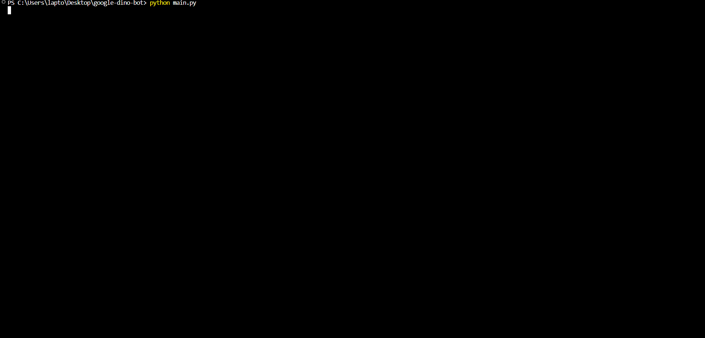
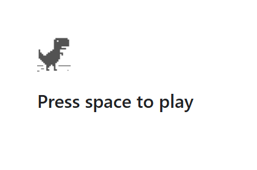
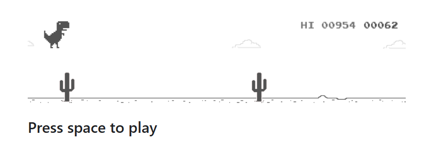
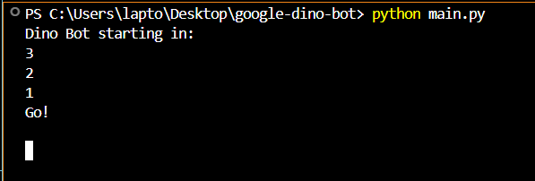

# 🦖 Google Dino Bot (Day Mode)

An automated bot that plays the Google Chrome Dino game by detecting obstacles in real time and jumping to avoid them — entirely hands-free.

---

## 🎥 Demo

> The bot starts the game automatically, monitors the screen for obstacles, and jumps with perfect timing — fully autonomous.



---

## 📸 Screenshots

### 🕹️ Before the Game Starts


### 🏃 During Gameplay (Bot Jumping)


### 💻 Terminal Output While Running


---

## 🚀 Overview

This project uses `pyautogui` and `Pillow` to:
- Take rapid screenshots of the game
- Analyze a fixed region for upcoming obstacles
- Trigger a spacebar press (jump) when an obstacle is detected

---

## ✨ Features

- 🔄 Automatically starts the Chrome Dino game
- 👁️ Real-time obstacle detection using pixel analysis
- 🦘 Instantly jumps over obstacles with perfect timing
- 🎯 Scans a focused region of the screen for accuracy
- 🧼 Cleanly structured and modular Python code
- 💻 Lightweight, runs locally with no setup beyond Python

---

## 📂 Project Structure

```
google-dino-bot/
├── bot/
│   ├── __init__.py
│   ├── config.py
│   ├── controller.py
│   └── detector.py
├── utils/
│   ├── __init__.py
│   └── screen_tools.py
├── media/
│   ├── demo/
│   │   └── demo.gif
│   └── screenshots/
│       ├── game_idle.png
│       ├── game_running.png
│       └── terminal_log.png
├── main.py
├── requirements.txt
└── .gitignore
```

---

## 🧪 How It Works

- Captures a specific portion of the screen where obstacles appear
- Converts the screenshot to grayscale
- Loops through every pixel and counts how many are “dark”
- If the number exceeds a threshold, the bot presses space to jump

---

## 🧠 What I Learned

- **Screen automation** with `pyautogui`
- **Image processing** using `Pillow`
- **Real-time obstacle detection** with pixel thresholding
- **Jump buffering** to avoid false positives or premature reactions
- **Structuring a Python project** with clear separation of concerns
- **Using Git & GitHub** for version control

---

## 🛠 Tech Stack

- **Language:** Python 3
- **Libraries:** `pyautogui`, `Pillow`
- **Tools:** Git, GitHub, VSCode, Snipping Tool, ScreenToGif

---

## ⚙️ Installation & Usage

1. Clone the repo:
   ```bash
   git clone https://github.com/Cyber-Security-Tech/google-dino-bot.git
   cd google-dino-bot
   ```

2. (Optional) Create a virtual environment:
   ```bash
   python -m venv venv
   source venv/bin/activate  # or venv\Scripts\activate on Windows
   ```

3. Install dependencies:
   ```bash
   pip install -r requirements.txt
   ```

4. Open Google Chrome and go to:
   ```
   chrome://dino
   ```

5. Run the bot:
   ```bash
   python main.py
   ```

---

## 🌌 Future Improvements

- 🌙 **Night Mode Support**: Automatically detect night mode based on brightness and reverse detection logic.
- 🧠 **Adaptive Thresholding**: Dynamically adjust darkness threshold based on environmental lighting.
- ⚡ **Performance Optimization**: Implement frame throttling and use NumPy for faster pixel analysis.
- 🎮 **GUI Toggle**: Add a simple GUI to enable/disable the bot or adjust config live.
- 🖼️ **Obstacle Preview Mode**: Display the captured game area with obstacle overlays for debugging.
- 📊 **Analytics**: Track score and log jump statistics over time.
- 🌐 **Multi-resolution Support**: Auto-adjust `GAME_AREA` based on screen resolution and browser zoom.

---
